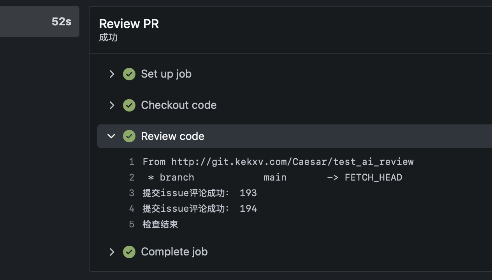
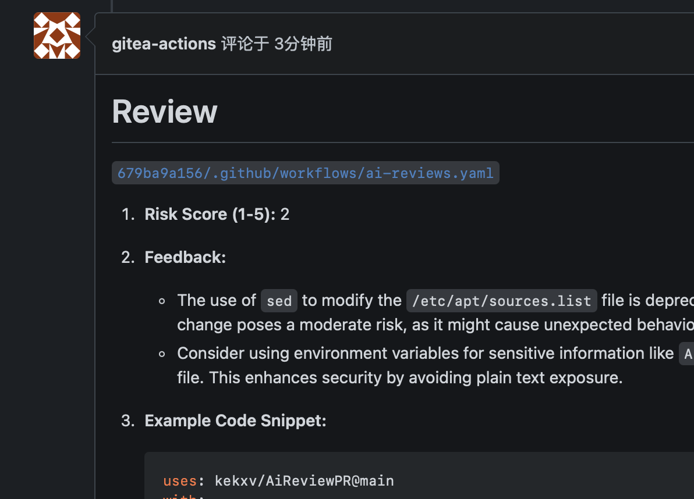
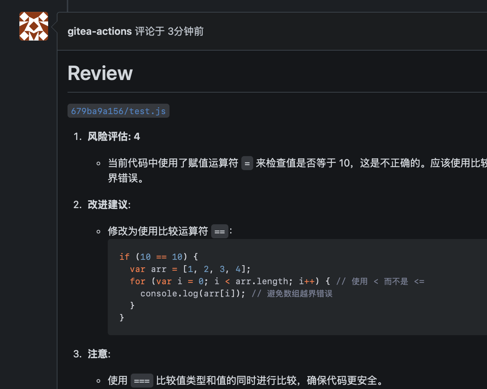

# 基于 Gitea 和 Ollama (open-webui) 的代码合并自动检查

如果您需要对合并的代码进行审核，但又希望避免将代码发送给第三方，或者您的网络环境处于离线状态（无法连接到第三方平台），那么本项目将是一个理想的选择。

该项目结合了 Gitea 和 Ollama (open-webui)，能够自动审核合并代码，并将结果通过评论的形式推送到相应的合并请求中，供开发人员或审核人员参考使用。

# Automatic Code Merge Checks Based on Gitea and Ollama (open-webui)

If you need to review your merged code but prefer not to send it to a third party, or if your network environment is offline (unable to connect to third-party platforms), then this project is an ideal choice.

This project integrates Gitea and Ollama (open-webui) to automatically review merged code and push the results as comments to the corresponding merge requests, allowing developers or reviewers to reference them.


- [如何使用 How to use](#如何使用-How-to-use)
- [输入参数](#输入参数)
- [Input Parameters](#input-parameters)

# 如何使用 How to use

使用方式和普通的 github actions 没什么区别(gitea actions 基本兼容 github actions)。

The usage is similar to regular GitHub Actions (Gitea Actions are mostly compatible with GitHub Actions).

需要设置一个 ollama host，如果使用的是 open-webui ，建议加上授权token。

You need to set up an Ollama host, and if you are using open-webui, it is recommended to include an authorization token.

```yaml
name: ai-reviews

on:
  pull_request:
    types: [opened, synchronize]

jobs:
  review:
    name: Review PR
    runs-on: ubuntu-latest

    steps:
      - name: Checkout code
        uses: actions/checkout@v4
        with:
          fetch-depth: 0
      - name: Review code
        uses: kekxv/AiReviewPR@v0.0.3
        with:
          model: 'gemma2:2b'
          host: ${{ vars.OLLAMA_HOST }}
          ai_token: ${{ secrets.AI_TOKEN }}
          exclude_files: |
            ^.+\.md
            test2\.js
```

效果如下：

result：





## Star History

[](https://star-history.com/#kekxv/AiReviewPR&Date)


## 输入参数

1. **repository**:
  - **描述**: 要审查的代码库名称，格式为 `owner/repository`，例如 `actions/checkout`。
  - **默认值**: `${{ github.repository }}`

2. **BASE_REF**:
  - **描述**: GitHub 事件中 Pull Request 的基线引用。
  - **默认值**: `${{ github.event.pull_request.base.ref }}`

3. **PULL_REQUEST_NUMBER**:
  - **描述**: GitHub 事件中 Pull Request 的编号。
  - **默认值**: `${{ github.event.pull_request.number }}`

4. **CHINESE**:
  - **描述**: 是否使用中文进行审查。
  - **默认值**: `"true"`

5. **token**:
  - **描述**: 用于获取存储库的个人访问令牌（PAT）。建议使用最小权限的服务帐户。
  - **默认值**: `${{ github.token }}`

6. **model**:
  - **描述**: 要用于代码审查的 AI 模型。
  - **必需**: 是
  - **默认值**: `'gemma2:2b'`

7. **host**:
  - **描述**: Ollama 主机地址。
  - **必需**: 是
  - **默认值**: `'http://127.0.0.1:11434'`

8. **reviewers_prompt**:
  - **描述**: Ollama 的系统提示。定义了代码审查的参数和预期格式。
  - **必需**: 否
  - **默认值**: 一段详细的说明文本，指导审查生成过程。

9. **ai_token**:
  - **描述**: AI 访问令牌。
  - **必需**: 否
  - **默认值**: `" "`

10. **include_files**:
  - **描述**: 要包含审查的文件列表，以逗号分隔，支持换行。
  - **必需**: 否
  - **默认值**: `" "`（默认为空，不限制）

11. **exclude_files**:
  - **描述**: 要排除审查的文件列表，以逗号分隔，支持换行。
  - **必需**: 否
  - **默认值**: `" "`（默认为空，不传递文件）

12. **PROMPT_GENRE**:
  - **描述**: 提示模式类型。
  - **必需**: 否
  - **默认值**: `" "`（默认为空）


### Input Parameters

1. **repository**:
  - **Description**: The name of the repository to review, formatted as `owner/repository`, for example, `actions/checkout`.
  - **Default Value**: `${{ github.repository }}`

2. **BASE_REF**:
  - **Description**: The base reference of the Pull Request in the GitHub event.
  - **Default Value**: `${{ github.event.pull_request.base.ref }}`

3. **PULL_REQUEST_NUMBER**:
  - **Description**: The number of the Pull Request in the GitHub event.
  - **Default Value**: `${{ github.event.pull_request.number }}`

4. **CHINESE**:
  - **Description**: Whether to use Chinese for the review.
  - **Default Value**: `"true"`

5. **token**:
  - **Description**: A Personal Access Token (PAT) used to access the repository. It is recommended to use a service account with the least necessary permissions.
  - **Default Value**: `${{ github.token }}`

6. **model**:
  - **Description**: The AI model to use for the code review.
  - **Required**: Yes
  - **Default Value**: `'gemma2:2b'`

7. **host**:
  - **Description**: The Ollama host address.
  - **Required**: Yes
  - **Default Value**: `'http://127.0.0.1:11434'`

8. **reviewers_prompt**:
  - **Description**: Ollama's system prompt. It defines the parameters and expected format for the code review.
  - **Required**: No
  - **Default Value**: A detailed description text guiding the review generation process.

9. **ai_token**:
  - **Description**: The AI access token.
  - **Required**: No
  - **Default Value**: `" "`

10. **include_files**:
  - **Description**: A comma-separated list of files to include in the review.
  - **Required**: No
  - **Default Value**: `" "` (empty by default, no restrictions)

11. **exclude_files**:
  - **Description**: A comma-separated list of files to exclude from the review.
  - **Required**: No
  - **Default Value**: `" "` (empty by default, no files passed)

12. **PROMPT_GENRE**:
- **描述**: prompt genre
- **必需**: No
- **默认值**: `" "` (empty by default)
